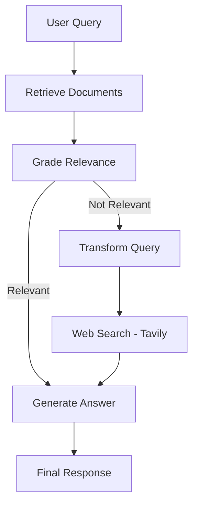

# Corrective RAG Agent

[](https://www.python.org/downloads/) [](LICENSE)

A self-correcting Retrieval-Augmented Generation pipeline built with LangGraph. Retrieves documents, grades their relevance with Claude 3.5 Sonnet, rewrites low-quality queries, and falls back to web search via Tavily when local retrieval fails — all orchestrated as a stateful graph.

## Architecture



## Features

- **Multi-stage retrieval** with Qdrant vector store and OpenAI embeddings
- **Relevance grading** via Claude 3.5 Sonnet structured output
- **Query transformation** to improve retrieval on ambiguous questions
- **Web search fallback** using Tavily API with retry logic
- **Multi-format input** — URLs, PDFs, and text files
- **Streamlit UI** with step-by-step workflow visibility

## Quick Start

```bash
git clone https://github.com/rchhabra13/corrective-rag.git
cd corrective-rag
pip install -r requirements.txt
cp .env.example .env  # Add your API keys
streamlit run corrective_rag.py
```

## Configuration

| Variable | Required | Description |
|----------|----------|-------------|
| `ANTHROPIC_API_KEY` | Yes | Claude 3.5 Sonnet for grading + generation |
| `OPENAI_API_KEY` | Yes | text-embedding-3-small for embeddings |
| `TAVILY_API_KEY` | No | Web search fallback (degrades gracefully) |
| `QDRANT_URL` | Yes | Qdrant instance URL (default: localhost:6333) |
| `QDRANT_API_KEY` | No | Qdrant Cloud API key |

## Tech Stack

Python, LangChain, LangGraph, Claude 3.5 Sonnet, OpenAI Embeddings, Qdrant, Tavily, Streamlit

## License

MIT
